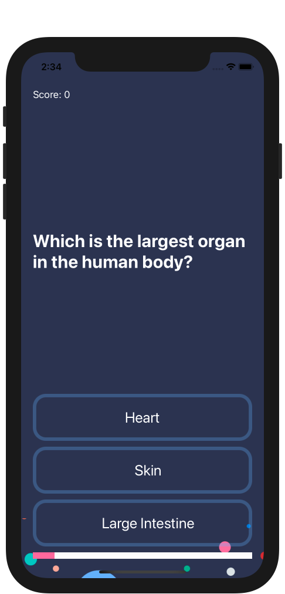
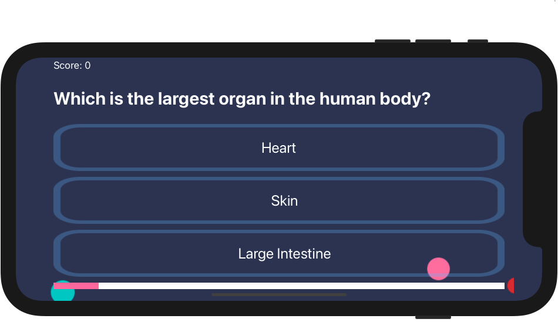
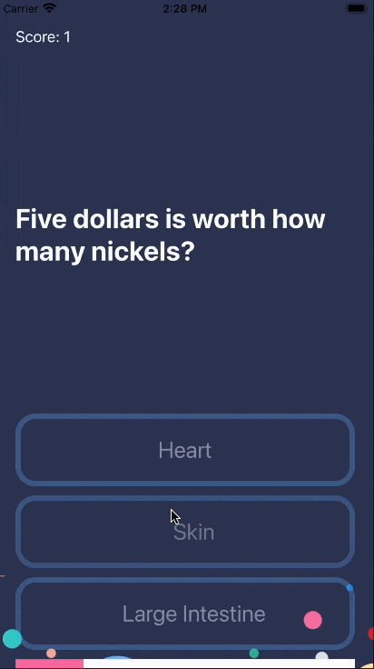

# QuizGame
### Screen Shots

---

### Table of Contents

- [Description](#description)
- [How To Use](#how-to-use)
- [Author Info](#author-info)

## Description

- Quiz Game, with multiple choice questions

---

### What I Learned:

- How to programmatically change UI elements such as Labels and Buttons.
- What is a design pattern and how is it used in programming.
- How to use the Model-View-Controller or MVC pattern for app development.
- Learn about Swift Structures how to instantiate a struct instance.
- Understand the difference between value types and reference types.
- Learn about Swift Classes and creating Objects.
- Compare Swift Classes with Swift Structs and know when to use which.
- Learn about Object Oriented Programming.
- How to refactor code and stay organised.

---

## How To Use

- Clone the project and run it on Xcode
---

## Author Info
- Website - [LinkedIn: Gurpreet Singh](https://www.linkedin.com/in/gurpreet-singh-a2651b107/)

[Back To The Top](#QuizGame)
